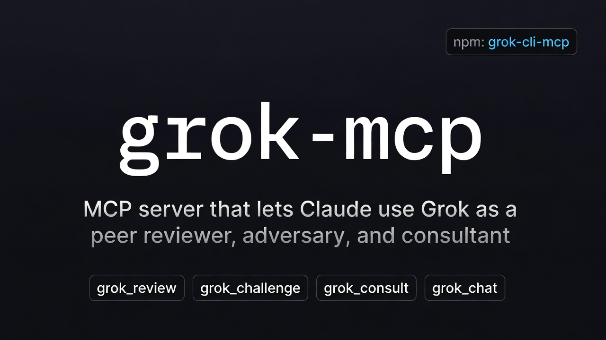

<p align="center">
  
</p>

# grok-mcp

[](https://www.npmjs.com/package/grok-cli-mcp)
[](https://registry.modelcontextprotocol.io/)

> 讓 Claude Code、Cursor、Cline、OpenClaw 等 MCP host 透過官方 xAI [Grok CLI](https://x.ai/news/grok-build-cli)，把 **Grok 當成 code reviewer、adversary 與第二意見顧問** 使用。

`grok-mcp`（npm 套件名 [`grok-cli-mcp`](https://www.npmjs.com/package/grok-cli-mcp)）是 [Model Context Protocol](https://modelcontextprotocol.io) server，將 `grok` CLI 包裝成工具，讓你的主要 agent（Claude、Cursor…）可以隨時叫 Grok 幫忙 review、挑戰、諮詢，而不用切換 session：

- `grok_review` — 結構化 diff review，附五維度評分
- `grok_challenge` — 對抗式找 bug / race / security hole
- `grok_consult` — 多輪諮詢（caller 自己重送 history）
- `grok_chat` — 一次性問答

English: [README.md](./README.md)

## 為什麼用 grok-mcp？

市面上其他 "Grok MCP" 套件大多讓 Claude 可以「使用」Grok 的 chat / search / image 能力。`grok-mcp` 反過來：讓你的主要 coding agent（Claude / Cursor）**請 Grok 來 review、挑戰自己的產出**。換一個 model 攻擊主 agent 的盲點，能抓到單模型 loop 找不到的 bug。

## 提供什麼

四個 tool，全部 stateless：

| Tool | 用途 |
|------|------|
| `grok_chat` | 一次性問答 |
| `grok_review` | 給 diff（或自動 `git diff main...HEAD`），回結構化 code review |
| `grok_consult` | 多輪對話，caller 自己重送 history |
| `grok_challenge` | 對抗模式：請 Grok 找 bug、race condition、security hole |

## 前置需求

- Node.js ≥ 18
- 已安裝 Grok CLI：
  ```bash
  curl -fsSL https://x.ai/cli/install.sh | bash
  ```
- 一種認證方式 — 瀏覽器 OAuth（互動跑一次 `grok`）**或**到 [console.x.ai](https://console.x.ai) 拿一把 `XAI_API_KEY`。詳見下方 [認證](#認證)。

## 安裝

```bash
npm install -g grok-cli-mcp
# 或直接 npx 不裝
npx grok-cli-mcp
```

> **為什麼 npm 套件名是 `grok-cli-mcp`？** 因為 `grok-mcp` 這個短名在 npm 上已被另一個無關專案佔走（一個 Grok HTTP API integration）。品牌、GitHub repo、MCP server 內部識別仍是 `grok-mcp`；只有 npm 安裝識別字改用 `grok-cli-mcp` — 反正這個套件就是 wrap 官方 **Grok CLI**，名字也算直白。

## 認證

包裝的 Grok CLI 支援兩種認證方式，`grok-mcp` 繼承當前啟用的那一種。

| 方式 | 適合場景 | Rate limit |
|------|---------|-----------|
| **API key**（`XAI_API_KEY` 環境變數）| MCP / CI / 自動化 | 按次計費，無訂閱配額上限 |
| **瀏覽器 OAuth**（互動跑 `grok` 登入）| 本機互動使用 | 依你的 grok.com 訂閱方案 |

依照 [xAI 認證優先順序](https://docs.x.ai/docs/api-reference#authentication)，`XAI_API_KEY` 永遠勝過 `~/.grok/auth.json`。所以可以保留瀏覽器登入給互動式 `grok` 用，**只在這個 MCP server 的 env block 加 `XAI_API_KEY`** 來覆蓋：

```json
{
  "mcpServers": {
    "grok": {
      "command": "npx",
      "args": ["-y", "grok-cli-mcp"],
      "env": {
        "XAI_API_KEY": "xai-...",
        "GROK_MCP_TIMEOUT": "600000"
      }
    }
  }
}
```

注意 API key 等同密鑰 — 會寫進 MCP host 的設定檔（例如 `~/.claude.json`），磁碟上是明文 JSON。

## 串到 MCP host

### Claude Code

推薦用 `add-json`，env block 才會正確 parse：

```bash
claude mcp add-json -s user grok '{
  "command": "npx",
  "args": ["-y", "grok-cli-mcp"],
  "env": { "XAI_API_KEY": "xai-...", "GROK_MCP_TIMEOUT": "600000" }
}'
```

> **為什麼不用 `claude mcp add -e ...`？** `-e KEY=val` 是 variadic flag，傳超過一個 `-e` 時，server 名字會被當成下一個 env value 吃掉。`add-json` 一次到位避開這個坑。

或直接編輯 `~/.claude.json`，最簡寫法（fallback 到 OAuth）：

```json
{
  "mcpServers": {
    "grok": {
      "command": "npx",
      "args": ["-y", "grok-cli-mcp"]
    }
  }
}
```

### Cursor

`.cursor/mcp.json`（專案）或 `~/.cursor/mcp.json`（全域）：

```json
{
  "mcpServers": {
    "grok": {
      "command": "npx",
      "args": ["-y", "grok-cli-mcp"]
    }
  }
}
```

### Cline (VS Code)

Settings → Cline → MCP Servers：

```json
{
  "grok": {
    "command": "npx",
    "args": ["-y", "grok-cli-mcp"]
  }
}
```

### 其他 MCP host

`grok-mcp` 跑標準 stdio MCP。任何 client 指向 `npx -y grok-cli-mcp` 即可。

## Tool 用法

### `grok_chat`

```json
{ "prompt": "兩句話解釋 consistent hashing。" }
```

可選 `model` 覆寫預設 Grok model；`timeout`（秒）拉長單次 call 的時限，給 grok-4 長推理用。四個 tool 都接受 `timeout`。

### `grok_review`

```json
{ "base_ref": "main", "focus": "security" }
```

沒給 `diff` 就跑 `git diff <base_ref>...HEAD`。預設回傳 markdown 評審，含整體判決、五維度評分（correctness / readability / architecture / security / performance）、具體修正建議。

傳 `"format": "json"` 可以拿到機器可讀的 JSON 輸出，適合 CI gate — 詳見下方 [當 PR gate 用](#當-pr-gate-用ci)。

### `grok_consult`

```json
{
  "messages": [
    { "role": "system", "content": "你是資深後端工程師。" },
    { "role": "user", "content": "這個 query 怎麼 cache？" },
    { "role": "assistant", "content": "兩個方案..." },
    { "role": "user", "content": "方案 2 的 failure mode 是什麼？" }
  ]
}
```

Server 不存 state，caller 每次帶完整 history。一般 MCP host 會自動處理。

### `grok_challenge`

```json
{
  "code": "function transfer(from, to, amount) { from.balance -= amount; to.balance += amount; }",
  "context": "Node.js，HTTP handler 並發呼叫"
}
```

回傳 severity 分級的問題（Critical / High / Medium / Low），含重現步驟與修補建議。

## 設定

| 環境變數 | 預設值 | 用途 |
|---------|--------|------|
| `XAI_API_KEY` | *（未設，fallback 到 OAuth）* | 到 [console.x.ai](https://console.x.ai) 拿。設定後會覆蓋 `~/.grok/auth.json`，切到按次計費、無訂閱配額上限。詳見 [認證](#認證)。 |
| `GROK_MCP_BIN` | `grok` | grok binary 路徑 |
| `GROK_MCP_TIMEOUT` | `300000` | 預設單次 call timeout（毫秒） |

預設 model 設定在 Grok CLI 自己的 `~/.grok/config.toml`。

### Timeout

grok-4 是 reasoning model，長 prompt 動輒超過兩分鐘。Server 預設單次時限為 **300 秒（5 分鐘）**，有三種調整方式：

- **單次 call** — 對任一 tool 傳 `timeout`（秒）：`{ "prompt": "...", "timeout": 600 }`。
- **整個 server** — 在 MCP server 的環境變數設 `GROK_MCP_TIMEOUT`（毫秒）。
- **Host 端** — MCP host 自己也有 request timeout，可能比 server 更早觸發。若上面兩項都調高仍超時，請一併拉高 host 的時限。在 Claude Code 是 `MCP_TIMEOUT`（server 啟動）與 `MCP_TOOL_TIMEOUT`（單次 tool call），單位皆為毫秒。

超時時，錯誤訊息會附上 Grok 在截止前已產生的 partial 輸出，避免快完成的答案整個丟失。

## 當 PR gate 用（CI）

`grok-mcp` 內附 `grok-review-ci` bin 跟 composite GitHub Action，讓 Grok 在每個 PR 評審並在 `block` 時擋下 check。

複製進你 repo 的 `.github/workflows/grok-review.yml`：

```yaml
name: Grok review
on: { pull_request: { branches: [main] } }
permissions: { contents: read, pull-requests: write }
jobs:
  grok:
    runs-on: ubuntu-latest
    if: ${{ github.event.pull_request.head.repo.full_name == github.repository }}
    steps:
      - uses: actions/checkout@v4
        with: { fetch-depth: 0 }
      - uses: howardpen9/grok-mcp/.github/actions/grok-review@main
        with:
          xai-api-key: ${{ secrets.XAI_API_KEY }}
          gate-on: block      # 也可以 block,request_changes
          # focus: security   # 可選
          # min-score: 6      # 可選 — 任一維度低於此值就 fail
```

Action 會在 PR 留 sticky comment（含 verdict、各維度分數、具體 blockers），並在 verdict 命中 `gate-on` 時讓 check 失敗。完整範例：[`examples/workflows/grok-review.yml`](./examples/workflows/grok-review.yml)。

想直接從 tool 拿 JSON？對 `grok_review` 傳 `format: "json"`，回傳 schema 跟 bin 輸出一致，可塞進任何 pipeline：

```json
{
  "verdict": "block",
  "summary": "src/db.ts 有未參數化的 SQL query。",
  "scores": { "correctness": 4, "readability": 7, "architecture": 5, "security": 2, "performance": 8 },
  "blockers": [
    { "severity": "critical", "title": "SQL injection", "file": "src/db.ts", "line": 42,
      "reason": "使用者輸入直接串接進 query。",
      "fix": "改用參數化 query：`db.query(sql, [userId])`。" }
  ],
  "notes": []
}
```

## Roadmap

- **v0.1** — 四個 stateless tool、stdio transport
- **Discoverability push（v0.1.3，已上）** — 統一命名、MCP Registry submission、Smithery、glama.ai 上架、加強定位。完整計畫見 [`docs/improvement-plan.md`](./docs/improvement-plan.md)，實際改了什麼見 [`CHANGELOG.md`](./CHANGELOG.md)。
- **v0.2（這版）** — `grok_review` JSON mode + `grok-review-ci` bin + GitHub Action 做 PR gate。
- **v0.3** — server 端 session 持久化，`grok_consult` 可帶 `conversation_id`
- **v0.4** — 透過 MCP `progress` notification 做 streaming

## 開發

```bash
git clone https://github.com/howardpen9/grok-mcp.git
cd grok-mcp
npm install
npm test
npm run build
```

## 聯絡方式

Bug 回報、需求許願 → [GitHub issues](https://github.com/howardpen9/grok-mcp/issues)。
也歡迎在 X 上 DM 我：[@0xHoward_Peng](https://x.com/0xHoward_Peng)。

## License

MIT
